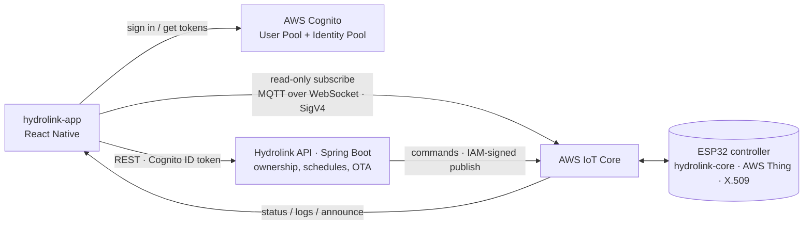

# Hydrolink App

Hydrolink started with a real need: controlling the irrigation on a countryside property without
checking on it constantly. It grew into a full IoT platform where ESP32 firmware, a Spring Boot API,
and a React Native app each run a layer and control real hardware. This repository is the mobile
app: the part a person actually touches. It shows the areas they own, the live state of every
station, the upcoming watering schedule, and the firmware update waiting to be installed.

The backend it talks to is a separate repository:

- [hydrolink-api](https://github.com/ivfrost/hydrolink-api) Spring Boot API, AWS IoT ingest and command gateway

The ESP32 firmware is closed source.

What works today:

- Sign in, register, confirm, and manage the account through AWS Cognito
- Link and unlink irrigation areas with a QR code or a link code
- Live area and station status, streamed from AWS IoT Core
- Start and stop supported stations, with the pending-until-confirmed contract
- Per-day watering schedules with fixed or relative time windows- Firmware update notifications with a tap-to-install OTA flow
- English and Spanish translations

## Stack

- React Native 0.86 with Expo SDK 57 and Expo Router
- React 19 and TypeScript, React Compiler enabled
- AWS Cognito (User Pool + Identity Pool) through Amplify v6
- AWS IoT Core for live device status, over MQTT-over-WebSocket with SigV4
- TanStack Query for server state, persisted to AsyncStorage
- Zustand for local device state, XState for the station action machine
- Zod for validating API responses and inbound MQTT payloads
## Architecture

The app never holds a device certificate and never publishes to a device. It authenticates against
Cognito, sends the ID token to the Hydrolink API as its bearer token, and lets the API decide who
owns what. For live status the app gets temporary Identity Pool credentials and opens a read-only
MQTT-over-WebSocket connection to AWS IoT Core, subscribed to the status, logs, and announce topics
of the devices the user owns.

Commands take the other path. A start, stop, reboot, or OTA install is a REST call to the API, which
validates ownership and safety rules, publishes to the device with IAM, and returns `202` accepted.
The station stays pending in the UI until the device's status message arrives over the live channel
and confirms the new state.



The app is deliberately on the read side of the bus. It subscribes to device topics, and every
write goes through the API, so ownership and safety rules live in one place instead of being
re-expressed as client permissions.

## Structure

| Path                | What it holds                                                                                |
| ------------------- | -------------------------------------------------------------------------------------------- |
| `app/`              | Expo Router routes: onboarding, auth, tabs, area, schedules, settings                        |
| `components/`       | UI by domain: areas, dashboard, schedules, profile, settings, status, and a shared `ui/` kit |
| `context/`          | MQTT lifecycle, network state, theme tokens                                                  |
| `services/`         | Amplify config, the AWS IoT read channel, device commands, OTA notifications                 |
| `queries/`          | TanStack Query fetchers and the persisted query client                                       |
| `mutations/`        | API write functions: areas, profile, schedules, storage                                      |
| `stores/`           | Zustand stores: areas, discovery, logs, header, onboarding                                   |
| `i18n/`, `locales/` | Translation helper and the English and Spanish dictionaries                                  |

## Notable pieces

- **Two identities, kept separate.** The Cognito _user pool subject_ authenticates the API call;
  the _identity pool id_ is what AWS IoT sees and what per-device IoT policies are attached to.
  The API resolves the caller's identity pool id server-side when linking or unlinking an area, so
  the app does not send or choose an identity id for those operations.
- **The read channel.** `services/mqtt.ts` presigns the IoT WebSocket URL with SigV4. AWS IoT's
  endpoint is a special dialect: with temporary credentials the session token is appended after
  signing, not folded into the canonical request. A per-connection nonce keeps the client id unique
  across reconnects, since IoT allows only one connection per id.
- **Accepted is not confirmed.** The API returns `202`; the UI keeps the station pending and waits
  for the device to report its new state on the read channel. A timeout clears a pending action if
  the device never reports, so the button cannot spin forever.
- **Tolerant parsing.** Device status is a complete snapshot that can vary: absent per-station
  schedules, an unclassified type the app does not know yet, or raw control bytes inside a string.
  The Zod schemas default and coerce rather than reject a whole snapshot, and `parseMqttJson`
  retries after stripping invalid bytes.
- **Images by object key.** Uploads persist the object key, not a presigned URL. Reads mint a fresh
  signed URL server-side, so stored images never expire.
- **Local discovery.** Devices are also found on the local network with mDNS (Zeroconf), so an area
  can be linked and shown as local even before the cloud round trip completes.

## Run locally

Requirements: Node (or Bun), and either the Expo Go app or a dev build for native modules. Copy
`.env.example` to `.env.local` and fill in the values; the app only reads `EXPO_PUBLIC_*` variables.

```bash
cp .env.example .env.local   # API base URL and the Cognito / IoT values
bun install                  # or npm install
bun start                    # expo start
```

Other scripts:

- `bun run android` / `bun run ios` build and run a dev client (needed for MQTT and camera)
- `bun run lint` runs ESLint through `expo lint`

> `bun run server` is defined in `package.json` but the `mocks/` directory is not present in this
> repository, so it will fail until that mock server is added.

The AWS values are not secrets. The user pool id, app client id, identity pool id, region, and IoT
endpoint are all public identifiers, but they are kept in env so the same build can point at a dev
or production stack. `EXPO_PUBLIC_API_BASE_URL` must include the API version prefix the backend
expects (for example `.../v1`); the app appends only the resource path to it.

## License

Released under the
[Creative Commons Attribution-NonCommercial 4.0 International](LICENSE) license. Noncommercial use
is fine; any other use needs permission.
